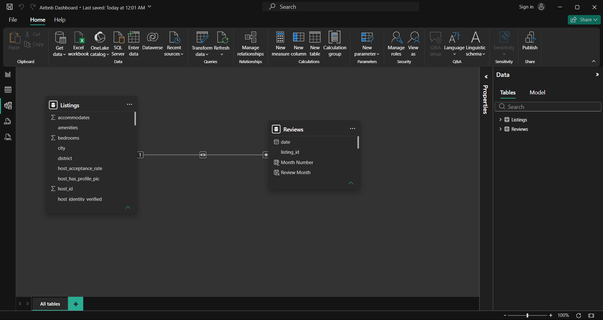

# Airbnb Analytics Dashboard (Power BI)

## Project Overview
This project presents an Airbnb Analytics Dashboard built using Power BI. The dashboard helps analyze Airbnb listing performance, customer ratings, reviews, and availability trends through interactive visualizations.

## Dataset Information

Source: Airbnb Listings Dataset

Key Fields:
- City
- Room Type
- Price
- Reviews
- Ratings
- Host Information
- Availability

## Objectives
- Analyze Airbnb listings and performance metrics
- Understand customer ratings and review patterns
- Identify trends and insights for better decision-making
- Create an interactive and user-friendly dashboard

## Skills Demonstrated
- Data Cleaning
- Data Transformation
- Data Modeling
- DAX Measures
- KPI Development
- Dashboard Design
- Data Visualization
- Business Intelligence

## Tools & Technologies
- Power BI
- Power Query
- DAX
- Data Visualization

## Dashboard Screenshots

### Overview Dashboard

### Ratings Analysis

### Reviews Analysis

## Data Model

## Key Insights
- Listing distribution and availability trends
- Customer satisfaction through ratings analysis
- Review behavior and engagement patterns
- Data-driven insights for business decisions

## Business Questions Answered

1. Which cities have the highest Airbnb market share?
2. Which room type generates the highest average price?
3. Which cities receive the best customer ratings?
4. How do reviews vary across locations?
5. What factors contribute to customer satisfaction?

## Key Findings

- Paris, New York, and Rome account for nearly half of total listings.
- Hotel rooms have the highest average price.
- Mexico City and Rio de Janeiro achieved the highest ratings.
- Customer satisfaction is strongly influenced by cleanliness and value.

## DAX Measures Used

- Average Price
- Average Rating
- Total Reviews
- Listing Count
- Market Share %
- Cumulative %

## Author
**Saurabh Dhama**
