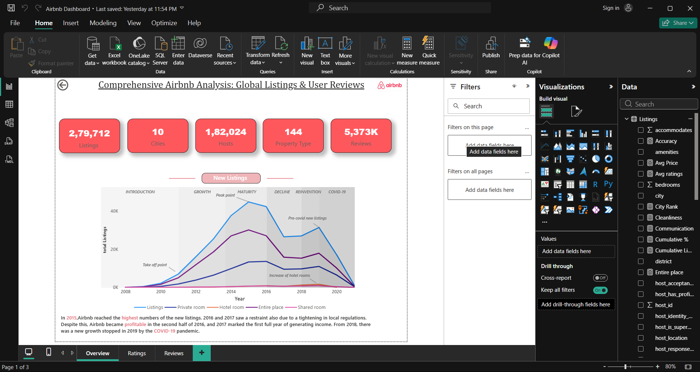
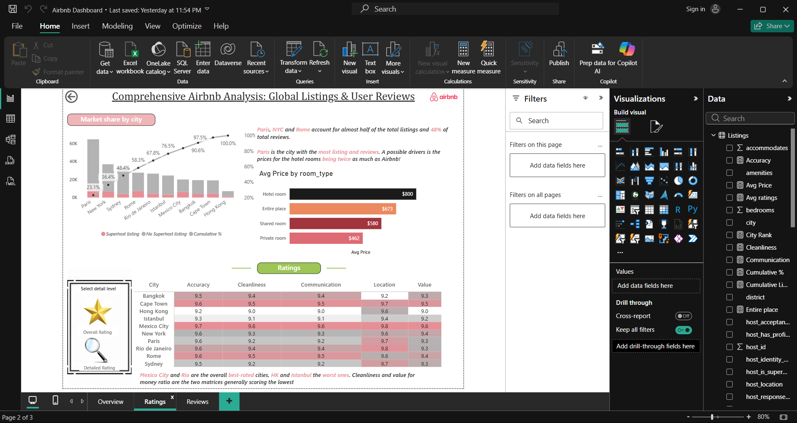
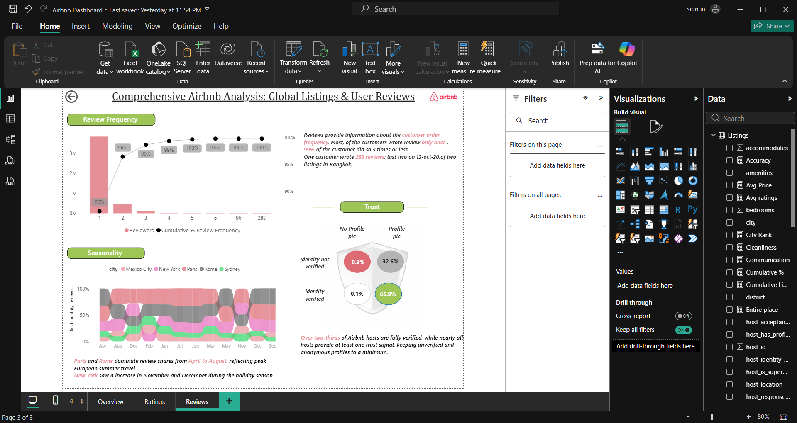

# Airbnb Analytics Dashboard (Power BI)

## Project Overview
This project presents an Airbnb Analytics Dashboard built using Power BI. The dashboard helps analyze Airbnb listing performance, customer ratings, reviews, and availability trends through interactive visualizations.

## Objectives
- Analyze Airbnb listings and performance metrics
- Understand customer ratings and review patterns
- Identify trends and insights for better decision-making
- Create an interactive and user-friendly dashboard

## Skills Demonstrated
- Data Cleaning
- Data Transformation
- Data Modeling
- DAX Measures
- KPI Development
- Dashboard Design
- Data Visualization
- Business Intelligence

## Tools & Technologies
- Power BI
- Power Query
- DAX
- Data Visualization

## Dashboard Screenshots

### Overview Dashboard

### Ratings Analysis

### Reviews Analysis

## Key Insights
- Listing distribution and availability trends
- Customer satisfaction through ratings analysis
- Review behavior and engagement patterns
- Data-driven insights for business decisions

## Author
**Saurabh Dhama**
